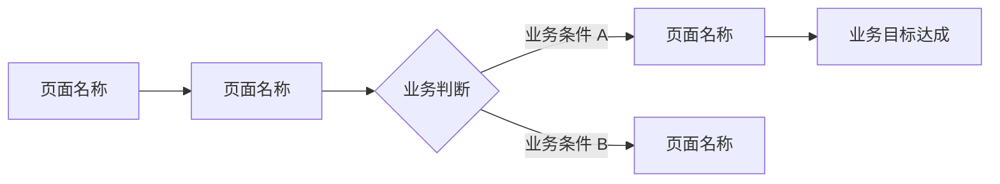

# 前端与小程序 PRD 模板

> 本文件包含两个端的专属章节模板，用 `---` 分隔，按需加载对应章节。
> - **Web 前端端**：加载 `PART A` 部分（`## PART A` 至下一个 `---`）
> - **微信小程序端**：加载 `PART B` 部分（`## PART B` 至文件末尾）
>
> **组合方式**：通用章节来自 `templates/common.md`，本文件仅定义各端专属章节（第 5 节）。

---

## PART A：Web 前端端模板

> **用途**：Web 前端 PRD 文档模板。适用于 Web 管理后台、Web 用户端、H5 页面等场景。
>
> ⚠️ **内容规则（强制，优先级最高）**：
> - 【R-001】PRD 文档中**禁止出现任何技术性描述**，包括但不限于：框架名称（Vue/React/Angular）、编程语言、构建工具、组件库名称、打包工具等。
> - 【R-002】所有描述必须是**业务语言**：描述"用户看到什么"和"用户能做什么"，而非"用什么技术实现"。
> - 【R-003】违反 R-001 的内容一律删除，不得以任何形式保留在 PRD 文档中。
> - 【R-005】界面描述只描述**业务交互行为**和**视觉风格要求**，禁止描述组件名称、事件名称、状态管理方案等技术实现。

### 加载说明

生成前端 PRD 时，按以下顺序组合章节：

| 章节来源 | 章节内容 |
|---------|---------|
| `templates/common.md` | 文档头部、第 1~4 节、第 6~11 节、文档尾部、通用质量检查清单 |
| 本文件 PART A | **第 5 节**（前端专属：用户界面需求，插入在第 4 节之后、第 6 节之前）、前端专属质量检查清单 |

> 前端 PRD 通常与后端 PRD 配套生成，前端文档聚焦页面、交互和视觉，后端文档聚焦业务规则和数据。
> 若项目仅有前端（无独立后端服务），则无需生成后端 PRD，但需在 `_概览.md` 中声明端类型。

### 第 5 节：用户界面需求（Web 前端专属）

> 本节描述 Web 前端的页面结构、交互流程和视觉风格要求。
> ⚠️ 禁止出现框架名称、组件库名称、技术实现方案等技术描述，只描述用户看到什么、能做什么。

#### 5.1 端类型声明

| 端类型 | 目标用户群体 | 主要使用设备 | 设计风格参考 |
|-------|-----------|-----------|-----------|
| Web 管理后台 / Web 用户端 | [目标用户描述] | PC 端 / 移动端 / 两者兼顾 | [如有设计稿或品牌规范，在此说明] |

**响应式要求**：
- [ ] 仅 PC 端（最小宽度 1280px）
- [ ] PC + 平板（最小宽度 768px）
- [ ] 全响应式（PC + 平板 + 手机）

#### 5.2 页面清单

> 列出所有需要开发的页面，每个页面说明其业务目的和核心内容。

| 页面名称 | 所属业务模块 | 优先级 | 页面业务说明 | 入口来源 |
|---------|-----------|-------|-----------|---------|
| [页面名称] | [所属业务模块] | M/S/C | [该页面的业务目的和核心展示内容] | [用户从哪里进入该页面] |

#### 5.3 核心交互流程

> 描述用户完成核心业务目标的页面跳转路径，使用流程图表达。
> ⚠️ 流程图中只描述业务步骤和页面名称，禁止出现路由路径、组件名等技术内容。



**核心流程说明：**

| 流程名称 | 流程描述 | 涉及页面 |
|---------|---------|---------|
| [核心业务流程名称] | [用户完成该业务目标的操作路径描述] | [涉及的页面列表] |

#### 5.4 页面交互细节

> 针对重要页面，描述各种业务状态下的界面表现。
> ⚠️ 只描述用户看到的内容和业务反馈，禁止描述加载动画实现方式、错误处理代码等技术内容。

| 页面名称 | 正常状态 | 加载中状态 | 空数据状态 | 业务错误状态 |
|---------|---------|---------|---------|-----------|
| [页面名称] | [正常情况下用户看到什么] | [数据加载时用户看到什么] | [无数据时用户看到什么] | [业务出错时用户看到什么，如何引导用户] |

#### 5.5 UI 视觉风格要求

> 描述整体视觉风格要求，为设计师提供方向指引。
> ⚠️ 禁止描述具体的样式属性值、设计系统名称等技术内容。

- **整体风格**：（如：简洁专业、现代轻量、企业级严谨等，描述视觉感受）
- **主色调**：（描述品牌色或色彩倾向，如"以蓝色为主色，传递专业可信赖感"）
- **字体规范**：（描述字体风格要求，如"正文清晰易读，标题有层次感"）
- **图标风格**：（如：线性图标、填充图标、统一风格等）
- **暗黑模式**：是否需要支持暗黑模式（是/否）
- **品牌规范参考**：（如有现有品牌规范文档，在此引用）

#### 5.6 导航与信息架构

> 描述整体导航结构和信息层级，帮助设计师规划页面布局。

**导航结构：**

```
[系统名称]
├── [一级菜单 1]
│   ├── [二级菜单 1.1]
│   └── [二级菜单 1.2]
├── [一级菜单 2]
│   └── [二级菜单 2.1]
└── [一级菜单 3]
```

**面包屑层级**：（描述页面层级深度要求，如"最多三级"）

### 前端 PRD 专属质量检查清单

> 在通用质量检查清单基础上，额外检查以下前端专属项：

**内容规则合规性（最高优先级）：**
- [ ] 【R-001】文档中无框架名称（Vue/React/Angular）、组件库名称、构建工具等技术描述
- [ ] 【R-005】界面描述只有业务交互行为和视觉风格，无组件名称、事件名称、路由路径等技术内容
- [ ] 第 5 节所有描述均为业务语言和用户视角

**前端专属完整性：**
- [ ] 第 5.1 节端类型声明已填写（响应式要求已勾选）
- [ ] 第 5.2 节页面清单已填写（所有 M 级页面已列出）
- [ ] 第 5.3 节核心交互流程已填写（至少覆盖 1 个核心业务流程）
- [ ] 第 5.4 节页面交互细节已填写（至少覆盖 M 级页面的 4 种状态）
- [ ] 第 5.5 节 UI 视觉风格要求已填写
- [ ] 第 5.6 节导航与信息架构已填写

**拆分文档完整性（含后端时）：**
- [ ] 配套的 `{项目名}_PRD_后端.md` 已生成
- [ ] `{项目名}_PRD_概览.md` 已生成（含端类型声明和各端文档路径）

**文件存储：**
- [ ] 文件路径：`doc/prd/{项目名}_PRD_前端.md`

---

## PART B：微信小程序端模板

> **用途**：微信小程序 PRD 文档模板。适用于微信小程序用户端、服务号小程序等场景。
>
> ⚠️ **内容规则（强制，优先级最高）**：
> - 【R-001】PRD 文档中**禁止出现任何技术性描述**，包括但不限于：小程序框架名称、技术文件类型、具体接口名称、云开发等技术方案。
> - 【R-002】所有描述必须是**业务语言**：描述"用户看到什么"和"用户能做什么"，而非"用什么技术实现"。
> - 【R-003】违反 R-001 的内容一律删除，不得以任何形式保留在 PRD 文档中。
> - 【R-006】微信能力描述只描述**业务目的**（如"用户可以用微信账号直接登录"），禁止描述具体的微信接口名称。

### 加载说明

生成小程序 PRD 时，按以下顺序组合章节：

| 章节来源 | 章节内容 |
|---------|---------|
| `templates/common.md` | 文档头部、第 1~4 节、第 6~11 节、文档尾部、通用质量检查清单 |
| 本文件 PART B | **第 5 节**（小程序专属：用户界面需求，插入在第 4 节之后、第 6 节之前）、小程序专属质量检查清单 |

> 小程序 PRD 通常与后端 PRD 配套生成，小程序文档聚焦页面、交互和微信生态能力，后端文档聚焦业务规则和数据。
> 若项目仅有小程序（无独立后端服务），则无需生成后端 PRD，但需在 `_概览.md` 中声明端类型。

### 第 5 节：用户界面需求（小程序专属）

> 本节描述微信小程序的页面结构、交互流程、微信生态能力需求和视觉风格要求。
> ⚠️ 禁止出现技术接口名称、框架名称、技术实现方案等描述，只描述用户看到什么、能做什么。

#### 5.1 端类型声明

| 端类型 | 目标用户群体 | 主要使用场景 | 设计风格参考 |
|-------|-----------|-----------|-----------|
| 微信小程序 | [目标用户描述] | [主要使用场景，如"外出时随时查询"、"线下扫码使用"等] | [如有设计稿或品牌规范，在此说明] |

#### 5.2 底部导航结构

> 描述小程序底部导航栏的结构，最多 5 个导航入口。

| 序号 | 导航名称 | 对应业务功能 | 图标说明 |
|-----|---------|-----------|---------|
| 1 | [导航名称] | [该导航承载的核心业务功能] | [图标风格描述，如"首页图标"] |
| 2 | [导航名称] | [该导航承载的核心业务功能] | [图标风格描述] |

> 如无底部导航（单页或纯功能型小程序），在此说明原因。

#### 5.3 页面清单

> 列出所有需要开发的页面，每个页面说明其业务目的和核心内容。

| 页面名称 | 所属业务模块 | 优先级 | 页面业务说明 | 入口来源 |
|---------|-----------|-------|-----------|---------|
| [页面名称] | [所属业务模块] | M/S/C | [该页面的业务目的和核心展示内容] | [用户从哪里进入该页面，如"底部导航"、"扫码"、"分享链接"等] |

#### 5.4 核心交互流程

> 描述用户完成核心业务目标的页面跳转路径，使用流程图表达。
> ⚠️ 流程图中只描述业务步骤和页面名称，禁止出现页面路径等技术内容。


**核心流程说明：**

| 流程名称 | 流程描述 | 涉及页面 |
|---------|---------|---------|
| [核心业务流程名称] | [用户完成该业务目标的操作路径描述] | [涉及的页面列表] |

#### 5.5 微信生态能力需求

> 描述小程序需要使用的微信生态能力，从业务目的角度说明。
> ⚠️ 只描述业务目的，禁止描述具体的微信接口名称或技术实现方式。

| 微信能力 | 业务目的 | 优先级 | 业务说明 |
|---------|---------|-------|---------|
| 微信账号登录 | 用户可以用微信账号直接登录，无需单独注册，降低使用门槛 | M/S/C | [补充说明该能力的业务场景] |
| 微信支付 | 用户可以在小程序内完成支付，无需跳转外部页面 | M/S/C | [补充说明支付场景] |
| 消息推送通知 | 业务事件发生时，主动通知用户，提升用户响应及时性 | M/S/C | [说明哪些业务事件需要推送通知] |
| 位置获取 | 获取用户当前位置，用于[具体业务场景] | M/S/C | [说明位置信息的业务用途] |
| 扫码功能 | 用户扫描二维码完成[具体业务操作] | M/S/C | [说明扫码的业务场景] |
| 图片/文件上传 | 用户可以上传[业务相关内容]，如证件照、报告等 | M/S/C | [说明上传内容的业务用途] |
| 分享功能 | 用户可以将[业务内容]分享给微信好友或朋友圈 | M/S/C | [说明分享的业务场景和内容] |

> 仅填写本项目实际需要的微信能力，删除不需要的行。

#### 5.6 页面交互细节

> 针对重要页面，描述各种业务状态下的界面表现。
> ⚠️ 只描述用户看到的内容和业务反馈，禁止描述技术实现方式。

| 页面名称 | 正常状态 | 加载中状态 | 空数据状态 | 业务错误状态 |
|---------|---------|---------|---------|-----------|
| [页面名称] | [正常情况下用户看到什么] | [数据加载时用户看到什么] | [无数据时用户看到什么] | [业务出错时用户看到什么，如何引导用户] |

#### 5.7 UI 视觉风格要求

> 描述整体视觉风格要求，为设计师提供方向指引。
> ⚠️ 禁止描述具体的样式属性值、设计系统名称等技术内容。

- **整体风格**：（如：简洁轻量、活泼年轻、专业严谨等，描述视觉感受）
- **主色调**：（描述品牌色或色彩倾向）
- **字体规范**：（描述字体风格要求，如"正文清晰易读，适合小屏阅读"）
- **图标风格**：（如：线性图标、填充图标、统一风格等）
- **品牌规范参考**：（如有现有品牌规范文档，在此引用）

#### 5.8 分包与离线需求

> 描述小程序的业务分包策略和离线使用需求。
> ⚠️ 只描述业务需求，禁止描述技术实现方式。

**分包需求：**
- [ ] 无分包需求（小程序体量较小）
- [ ] 需要分包（业务原因：[如"部分功能使用频率低，按需加载提升首次打开速度"]）

**离线使用需求：**
- [ ] 无离线需求（需要网络连接才能使用）
- [ ] 需要支持离线使用（可离线业务功能：[具体业务功能]）

### 小程序 PRD 专属质量检查清单

> 在通用质量检查清单基础上，额外检查以下小程序专属项：

**内容规则合规性（最高优先级）：**
- [ ] 【R-001】文档中无框架名称、技术文件类型、云开发等技术方案描述
- [ ] 【R-006】微信能力描述只有业务目的，无具体微信接口名称
- [ ] 第 5 节所有描述均为业务语言和用户视角

**小程序专属完整性：**
- [ ] 第 5.1 节端类型声明已填写
- [ ] 第 5.2 节底部导航结构已填写（或说明无底部导航的原因）
- [ ] 第 5.3 节页面清单已填写（所有 M 级页面已列出，含入口来源）
- [ ] 第 5.4 节核心交互流程已填写（至少覆盖 1 个核心业务流程）
- [ ] 第 5.5 节微信生态能力需求已填写（仅保留实际需要的能力）
- [ ] 第 5.6 节页面交互细节已填写（至少覆盖 M 级页面的 4 种状态）
- [ ] 第 5.7 节 UI 视觉风格要求已填写
- [ ] 第 5.8 节分包与离线需求已勾选

**拆分文档完整性（含后端时）：**
- [ ] 配套的 `{项目名}_PRD_后端.md` 已生成
- [ ] `{项目名}_PRD_概览.md` 已生成（含端类型声明和各端文档路径）

**文件存储：**
- [ ] 文件路径：`doc/prd/{项目名}_PRD_小程序.md`
