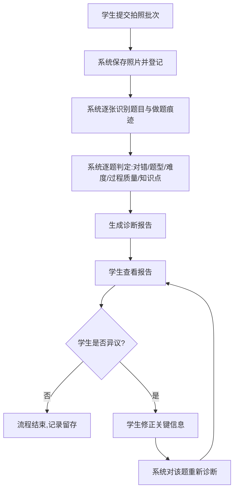

# AI 学习助手 — 拍照诊断最小闭环 PRD（后端服务）

**文档编号**：PRD-20260808-001
**版本**：v1.0.0
**状态**：🟡 草稿
**创建日期**：2026-08-08
**最后更新**：2026-08-08
**作者**：AI 协作（用户主导）
**审核人**：待定
**关联文档**：`doc/prd/拍照录入MVP_PRD_概览.md`、`doc/prd/拍照录入MVP_PRD_小程序.md`

---

## 第 1 节：执行摘要

- **一句话定义**：AI 学习助手是一个供初高中学生用于**拍照记录做题情况并获取薄弱点诊断**的学习工具，解决了"做完题不知道自己哪里薄弱、错因是什么"的痛点。
- **核心业务价值**：学生只需拍下做题照片，系统自动识别题目和作答痕迹，输出每道题的对错、难度档位和过程质量判定，帮助学生在 9/1 开学前建立"日常做题 → 自动诊断"的习惯。
- **预期成功指标**：
  - 最小闭环上线后，链路可用率 ≥ 95%（拍照→报告不中断）
  - 内测阶段完成 ≥ 30 次真实拍照诊断
  - 诊断单题平均耗时 ≤ 60 秒

## 第 2 节：项目背景与目标

### 2.1 背景描述

- **当前业务痛点**：学生每天做大量数学题，但缺少系统化的错因分析；自己复盘常停留在"粗心了"层面，无法定位到具体知识薄弱点。
- **立项时机**：五维能力框架与知识图谱（361 节点）已完成，诊断算法经 POC 实测验证（视觉转录、判定 rubric、难度 11 档钳制全部跑通），具备工程化条件；距 9/1 开学剩 32 天。

### 2.2 业务目标

| 目标编号 | 业务目标描述 | 时间框架 |
|---------|------------|---------|
| G-001 | 拍照→诊断→报告最小闭环端到端可用（内测） | 2026-08-15 前 |
| G-002 | 面向 120+ 学生开放使用 | 2026-09-01 前 |

### 2.3 成功指标

| 指标名称 | 当前值 | 目标值 | 衡量方式 | 时间框架 |
|---------|-------|-------|---------|---------|
| 链路可用率 | 0（未上线） | ≥95% | 诊断请求成功比例 | 上线后 |
| 内测诊断次数 | 0 | ≥30 次 | 诊断记录统计 | 内测期 |
| 单题诊断耗时 | POC ~30s | ≤60s | 诊断耗时统计 | 上线后 |

### 2.4 项目范围

**范围内（In Scope）：**
- 接收学生提交的做题照片（一批最多 9 张），保存并登记
- 识别照片中的题目内容与做题痕迹
- 对每道题输出判定结果：对错、题型分类、难度档位（11 档）、过程质量、知识点关联
- 生成诊断报告数据，供小程序展示
- 支持「异议→修正→重新诊断」流程
- 提供知识图谱数据（361 节点，按章/节层级组织）

**范围外（Out of Scope）：**
- 归因深度分析（直接原因/行动建议，P1）
- 掌握度数值计算与更新（K/A/T 维度，P1）
- 语音输入与过程校准 AI（P1）
- AI 教练对话（P2）
- 反馈闭环（趋势图、行动建议推送，P2）

**假设条件：**
- 学生使用微信小程序端发起诊断（后端不独立对外）
- 诊断模型能力以 POC 实测为准（视觉转录对 ≥ 符号偶有误读，靠报告异议兜底）
- 初期使用量低（120+ 学生低频使用），无需大规模并发设计

## 第 3 节：用户角色与场景

### 3.1 用户画像

| 用户类型 | 描述 | 使用频率 | 核心业务需求 |
|---------|------|---------|------------|
| 学生（初升高） | 每天做数学作业/练习，想知道薄弱点 | 每天 1-3 次 | 拍下做过的题，自动知道对错和问题所在 |

### 3.2 使用场景

| 场景编号 | 场景描述 | 用户 | 业务目标 |
|---------|---------|------|---------|
| SC-001 | 学生做完一张随堂练习，拍下照片想看看自己哪些题有问题 | 学生 | 快速获得每题对错与诊断 |
| SC-002 | 学生觉得某题判错了，想申诉纠正 | 学生 | 修正诊断结果 |

### 3.3 用户旅程

```
学生完成做题 → 打开小程序拍照（最多 9 张）→ 点「完成」→ 等待分析
→ 查看诊断报告（每题对错/难度/依据）→ 对可疑题目点「我觉得不对」→ 修正 → 重新诊断
```

## 第 4 节：功能需求

### 4.1 业务流程



### 4.2 功能列表

| 编号 | 功能 | 优先级 | 业务说明 |
|------|------|-------|---------|
| F-001 | 拍照批次接收 | M | 接收学生提交的一批照片（≤9 张），保存并登记为一次诊断批次 |
| F-002 | 题目识别 | M | 识别每张照片中的题目文本、选项内容、做题痕迹（涂改/草稿/最终答案） |
| F-003 | 对错判定 | M | 结合题目与作答，判定每道题是否正确；无标准答案时按可解性处理 |
| F-004 | 题型分类 | M | 每道题归为：回忆类/单元内应用/跨单元应用/无法归类 |
| F-005 | 难度分档 | M | 每道题按 11 档难度标尺分档（锚点：0.60 对应高考 90 分），档内给出难度值 |
| F-006 | 过程质量评估 | M | 对解答题评估解题路径质量（0.4~1.0）；填空/选择题无过程则不评 |
| F-007 | 知识点关联 | M | 每道题关联到知识图谱中的知识点；关联不上标记"待确认" |
| F-008 | 诊断报告生成 | M | 汇总一批题的判定结果，形成报告数据 |
| F-009 | 异议与重诊 | M | 学生对某题发起异议 → 修正关键信息 → 仅该题重新诊断 |
| F-010 | 图谱数据提供 | M | 提供知识点层级数据与节点详情（361 节点） |

**验收标准（AC）：**

- **F-001**：Given 学生已选择拍照照片 When 提交一批（≤9 张）Then 系统保存全部照片并登记为一个批次
- **F-003**：Given 一道有标准答案的题 When 系统完成判定 Then 输出明确的对错结论
- **F-005**：Given 一道题 When 系统分档 Then 难度落在 11 档内且档位判定可复现（同题两次判定档位一致）
- **F-009**：Given 学生对某题点了异议并修正 When 提交 Then 仅该题重新诊断，批次其他题结果不变

---

## 第 5 节：业务规则与数据规范（后端专属）

### 5.1 核心业务规则

| 规则编号 | 业务规则描述 | 适用场景 | 违反后果 |
|---------|-----------|---------|---------|
| BR-001 | 一次诊断批次最多 9 张照片，超出部分拒绝接收 | 学生拍照提交 | 提示学生减少数量 |
| BR-002 | 题目诊断记录一经生成不可删除，只可追加修正记录 | 所有诊断 | 保证数据可回溯（决策 016 原则） |
| BR-003 | 难度档位有硬边界（11 档区间），判定值不得越界 | 难度分档 | 钳制回档位区间 |
| BR-004 | 填空题/选择题不评估过程质量（无过程证据） | 过程质量评估 | 不输出过程质量值 |
| BR-005 | 学生对某题异议修正后，仅该题重新诊断，不重跑整批 | 异议流程 | 批次其他题结果保持 |

### 5.2 业务数据规范

- **数据保留策略**：诊断记录、题目记录、照片长期保留（作为掌握度分析的原始数据，至少保留 1 学年）
- **数据归档规则**：无归档需求（数据量小，免费容量足够）
- **数据清理规则**：不主动清理任何诊断数据；照片由学生本人可删（后续版本）
- **数据一致性要求**：一次批次的诊断结果作为一个整体保存，部分失败时保留成功部分并标记失败题（C2 降级）

### 5.3 业务流程约束

| 约束编号 | 业务流程约束描述 | 前置条件 | 后置条件 |
|---------|--------------|---------|---------|
| PC-001 | 题目必须先完成识别，才能进行判定 | 照片已保存 | 识别结果已生成 |
| PC-002 | 判定完成后才能生成报告 | 该题判定完成 | 报告数据可读 |
| PC-003 | 异议修正后才能对该题重新诊断 | 学生已提交修正 | 该题新判定结果生效 |

### 5.4 业务异常处理规范

| 业务异常场景 | 业务处理方式 | 是否需要人工介入 | 通知对象 |
|-----------|-----------|--------------|---------|
| 单张照片识别失败 | 标记该题「分析失败」，展示原图，引导重新上传；批次其他题照常出报告 | 否 | 学生 |
| 整批诊断超时 | 提示"分析超时，请重试"，允许重新提交 | 否 | 学生 |
| 题目关联不上知识点 | 标记"待确认"，不阻塞该题诊断与报告 | 否 | 学生 |

### 5.5 业务集成需求

| 集成系统 | 集成业务目的 | 数据流向 | 集成优先级 |
|---------|-----------|---------|---------|
| 图像识别服务 | 从照片识别题目文本与做题痕迹 | 照片 → 识别结果 | M |
| 诊断分析服务 | 基于识别结果与判定标准输出诊断参数 | 识别结果 → 判定结果 | M |
| 知识图谱数据 | 提供知识点层级供题目关联与浏览 | 图谱数据 → 题目关联/浏览 | M |

---

## 第 6 节：非功能需求

| 编号 | 类别 | 需求描述 |
|------|------|---------|
| NFR-001 | 性能 | 单题诊断平均耗时 ≤ 60 秒；整批（9 张）≤ 3 分钟 |
| NFR-002 | 可靠性 | 单张失败不影响整批；诊断失败可重试 |
| NFR-003 | 数据安全 | 照片与诊断记录仅本人可见，不对外公开 |
| NFR-004 | 可扩展性 | 诊断参数与判定标准集中管理，便于后续校准（决策 014 原则） |
| NFR-005 | 可观测性 | 记录每次诊断的输入输出，便于复盘与校准（POC 已验证） |

---

## 文档尾部

### 更新日志

| 版本 | 日期 | 变更说明 |
|------|------|---------|
| v1.0.0 | 2026-08-08 | 初稿：最小闭环后端需求（拍照→诊断→报告 + 图谱数据） |
