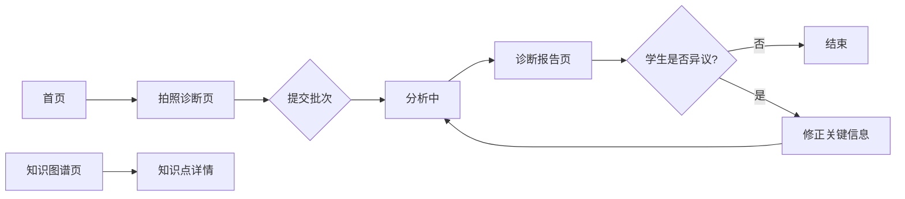
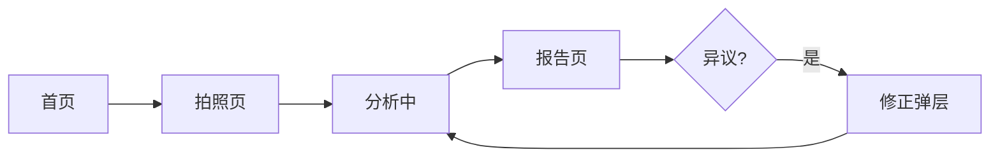

# AI 学习助手 — 拍照诊断最小闭环 PRD（微信小程序）

**文档编号**：PRD-20260808-002
**版本**：v1.0.0
**状态**：🟡 草稿
**创建日期**：2026-08-08
**最后更新**：2026-08-08
**作者**：AI 协作（用户主导）
**审核人**：待定
**关联文档**：`doc/prd/拍照录入MVP_PRD_概览.md`、`doc/prd/拍照录入MVP_PRD_后端.md`

---

## 第 1 节：执行摘要

- **一句话定义**：AI 学习助手小程序是初高中学生**拍题即诊断**的入口，学生拍照提交后获得每题对错与诊断报告，并可浏览知识点图谱。
- **核心业务价值**：把"做题 → 想复盘"的成本降到"拍照"一步；把"不知道自己哪里薄弱"变成"系统告诉我"。
- **预期成功指标**：内测完成 ≥30 次拍照诊断；拍照→报告全程无人工干预；报告异议使用率 ≥5%（说明学生在用证据核对）。

## 第 2 节：项目背景与目标

### 2.1 背景描述

- **当前业务痛点**：学生缺少低成本的自查工具；现有做题反馈只有"对错"没有"为什么"。
- **立项时机**：后端诊断能力已 POC 验证，小程序端是学生触达入口，需 9/1 前开放。

### 2.2 业务目标

| 目标编号 | 业务目标描述 | 时间框架 |
|---------|------------|---------|
| G-001 | 学生能在小程序内完成"拍照→报告"全流程 | 2026-08-15（内测） |
| G-002 | 学生能浏览知识图谱并查看知识点详情 | 2026-08-15（内测） |

### 2.3 成功指标

| 指标名称 | 当前值 | 目标值 | 衡量方式 | 时间框架 |
|---------|-------|-------|---------|---------|
| 拍照诊断完成率 | 0 | ≥80%（发起拍照的用户最终看到报告） | 流程漏斗统计 | 内测期 |
| 报告异议使用率 | 0 | ≥5% | 异议次数/报告次数 | 内测期 |

### 2.4 项目范围

**范围内（In Scope）：**
- 拍照诊断页（拍照/选图 → 提交 → 等待 → 报告入口）
- 诊断报告页（每题判定展示 + 「我觉得不对」异议 + 修正重诊）
- 知识图谱页（知识点层级浏览 + 节点详情）
- 底部导航：首页 / 知识图谱 / 我的（沿用现有骨架）

**范围外（Out of Scope）：**
- 精致 UI 与动画打磨（本轮体验全部占位，功能优先）
- 语音输入、过程校准（P1）
- 掌握度可视化、趋势图（P1/P2）
- AI 教练对话（P2）

**假设条件：**
- 学生已有微信，登录沿用现有微信账号体系
- 页面布局基于现有小程序骨架扩展（首页/知识树已有雏形）

## 第 3 节：用户角色与场景

### 3.1 用户画像

| 用户类型 | 描述 | 使用频率 | 核心业务需求 |
|---------|------|---------|------------|
| 学生（初升高） | 每天做数学题，想知道薄弱点 | 每天 1-3 次 | 拍题即诊断、看报告、查知识点 |

### 3.2 使用场景

| 场景编号 | 场景描述 | 用户 | 业务目标 |
|---------|---------|------|---------|
| SC-001 | 晚自习做完一套题，拍照提交，等报告 | 学生 | 快速知道每道题对错与难度 |
| SC-002 | 报告显示某题"做错了"，但学生觉得判错 | 学生 | 发起异议，修正后重看 |
| SC-003 | 想复习"集合"章节，看有哪些知识点 | 学生 | 浏览知识图谱 |

### 3.3 用户旅程

```
打开小程序 → 首页点「拍照诊断」→ 拍照/选图（≤9 张）→ 点「完成」
→ 等待"分析中"→ 查看诊断报告 →（可选）异议修正 → 重新诊断
或：底部导航切「知识图谱」→ 选章节 → 看知识点 → 点开详情
```

## 第 4 节：功能需求

### 4.1 业务流程



### 4.2 功能列表

| 编号 | 功能 | 优先级 | 业务说明 |
|------|------|-------|---------|
| F-001 | 拍照入口 | M | 首页提供「拍照诊断」入口，进入拍照页 |
| F-002 | 拍照/选图 | M | 学生拍照或从相册选择（一次 ≤9 张），支持预览与删除 |
| F-003 | 提交与分析 | M | 点「完成」提交批次，展示"分析中"状态（预计耗时） |
| F-004 | 报告展示 | M | 按题展示：对错、题型、难度档位、过程质量、判定依据 |
| F-005 | 报告异议 | M | 每题提供「我觉得不对」入口 → 弹出关键信息回显 → 学生修正 → 该题重诊 |
| F-006 | 失败降级展示 | M | 单张失败：标记"分析失败"+ 展示原图 + 引导重传 |
| F-007 | 图谱层级浏览 | M | 按章→节→知识点层级展示 361 节点 |
| F-008 | 知识点详情 | M | 点开知识点查看名称、概念描述、所属章节 |

**验收标准（AC）：**

- **F-002**：Given 学生进入拍照页 When 选择照片 Then 可预览并确认，最多 9 张
- **F-004**：Given 诊断完成 When 打开报告 Then 每题显示对错、难度档位与判定依据
- **F-005**：Given 报告页某题 When 学生点「我觉得不对」并修正 Then 仅该题重新诊断并刷新
- **F-006**：Given 某张照片识别失败 When 报告生成 Then 该题显示"分析失败"+ 原图 + 重传引导，其他题正常

---

## 第 5 节：用户界面需求（小程序专属）

### 5.1 端类型声明

| 端类型 | 目标用户群体 | 主要使用场景 | 设计风格参考 |
|-------|-----------|-----------|-----------|
| 微信小程序 | 初升高学生（14-16 岁） | 晚自习/家中做题后拍题诊断、查知识点 | 项目设计语言 v1.1（Apple/Notion 白色简约）+ 教育 teal 色系 |

### 5.2 底部导航结构

| 序号 | 导航名称 | 对应业务功能 | 图标说明 |
|-----|---------|-----------|---------|
| 1 | 首页 | 拍照诊断入口、最近报告 | 首页图标 |
| 2 | 知识图谱 | 知识点层级浏览 | 图谱图标 |
| 3 | 我的 | 个人记录（沿用现有） | 我的图标 |

> 拍照诊断页与报告页为二级页面，从首页进入。

### 5.3 页面清单

| 页面名称 | 所属业务模块 | 优先级 | 页面业务说明 | 入口来源 |
|---------|-----------|-------|-----------|---------|
| 首页 | 拍照诊断 | M | 提供「拍照诊断」主入口，展示最近诊断记录 | 底部导航 |
| 拍照页 | 拍照诊断 | M | 拍照/选图、预览删除、提交分析 | 首页按钮 |
| 报告页 | 拍照诊断 | M | 逐题展示判定结果与依据，支持异议 | 分析完成后跳转 |
| 知识图谱页 | 知识图谱 | M | 章节→知识点层级浏览 | 底部导航 |
| 知识点详情页 | 知识图谱 | M | 单个知识点的概念与说明 | 图谱页点击 |

### 5.4 核心交互流程



**核心流程说明：**

| 流程名称 | 流程描述 | 涉及页面 |
|---------|---------|---------|
| 拍照诊断 | 首页 → 拍照 → 提交 → 分析中 → 报告（→ 异议修正 → 重诊） | 首页/拍照页/报告页 |
| 图谱浏览 | 知识图谱页 → 选章节 → 选知识点 → 详情 | 知识图谱页/知识点详情页 |

### 5.5 微信生态能力需求

| 微信能力 | 业务目的 | 优先级 | 业务说明 |
|---------|---------|-------|---------|
| 微信账号登录 | 学生用微信账号直接登录，无需单独注册 | M | 沿用现有登录体系，识别学生身份 |
| 拍照/相册选择 | 学生拍摄做题照片或从相册选择 | M | 拍照诊断的核心输入 |
| 图片上传 | 将做题照片提交给系统分析 | M | 支撑拍照诊断全流程 |

### 5.6 页面交互细节

| 页面名称 | 正常状态 | 加载中状态 | 空数据状态 | 业务错误状态 |
|---------|---------|---------|---------|-----------|
| 首页 | 显示「拍照诊断」大按钮 + 最近诊断列表 | 列表加载骨架 | 无诊断记录时引导"拍第一道题" | 加载失败提示重试 |
| 拍照页 | 照片网格（可删）+「完成」按钮（数量角标） | 提交后转"分析中" | 未选照片时「完成」不可点 | 超 9 张提示"最多 9 张" |
| 报告页 | 每题卡片：对错/难度/依据 +「我觉得不对」 | 单题重诊时该题转"重新分析" | 无题目时提示"本批无有效题目" | 单张失败显示"分析失败"+ 原图 + 重传 |
| 知识图谱页 | 章节列表 → 知识点树 | 加载骨架 | 无数据提示"图谱加载中" | 失败提示重试 |

### 5.7 UI 视觉风格要求

> 设计规范来源：ui-ux-pro-max 教育类设计系统 + 项目设计语言 v1.1（Apple/Notion 白色简约）。

- **整体风格**：苹果风简约、干净清爽；大圆角卡片、留白充足；拒绝花哨，专注学习场景
- **主色调**：教育青绿色（teal）为主色，传达专注与成长；辅以白色背景、深色文字；成功/失败用语义色（绿/红）但必须配文字说明（不单靠颜色表达）
- **字体规范**：正文清晰易读（适配小屏），标题有层次；不用幼态卡通字体（目标用户是初升高学生，非儿童）
- **图标风格**：线性图标统一描边，不用 emoji 做结构图标；触控目标 ≥44pt
- **动效要求**：微交互（150-300ms），页面过渡流畅；尊重系统"减少动态效果"设置；动画只表达因果（点击反馈、状态变化），不做装饰动画
- **暗黑模式**：本轮不支持（占位），后续版本评估
- **品牌规范参考**：项目设计语言 v1.1 文档

### 5.8 分包与离线需求

**分包需求：**
- [x] 无分包需求（小程序体量较小）

**离线使用需求：**
- [x] 无离线需求（诊断需联网调用系统能力）

---

## 第 6 节：非功能需求

| 编号 | 类别 | 需求描述 |
|------|------|---------|
| NFR-001 | 性能 | 拍照→报告全流程 ≤3 分钟（一批 9 张）；页面首屏加载 ≤2 秒 |
| NFR-002 | 可用性 | 拍照页操作单手可完成；错误状态均有引导 |
| NFR-003 | 兼容性 | 适配常见手机屏幕（375px 起），无横向滚动 |
| NFR-004 | 隐私 | 照片与诊断记录仅本人可见；分享功能不在本轮（C5 暂缓） |

---

## 文档尾部

### 更新日志

| 版本 | 日期 | 变更说明 |
|------|------|---------|
| v1.0.0 | 2026-08-08 | 初稿：最小闭环小程序需求（拍照诊断 + 图谱浏览，体验占位） |
